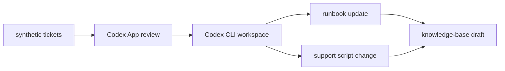

# Service Desk Knowledge Loop

Codex POC that turns synthetic recurring service desk tickets into a local review-and-update workflow for runbooks, support scripts, and knowledge-base drafts.

## Flow



## Getting Started

```bash
pnpm install
pnpm ingest:tickets
pnpm cluster:incidents
pnpm brief:pattern
pnpm test
pnpm dev
pnpm build
pnpm preview
```

TODO: add supported local commands for full demo simulation, reset, and replay.

## Current Demo Artifacts

- `generated/incident-clusters.json` is produced by `pnpm cluster:incidents` or `pnpm brief:pattern`.
- `reviews/incident-pattern-brief-vpn-login-failures.md` is the Phase 4 sample review brief for the selected demo cluster.
