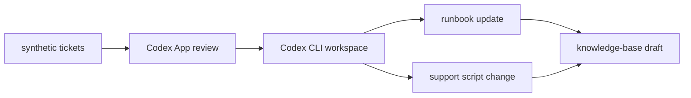

# Service Desk Knowledge Loop

Codex POC that turns synthetic recurring service desk tickets into a local review-and-update workflow for runbooks, support scripts, and knowledge-base drafts.

## Flow



## Getting Started

```bash
pnpm install
pnpm reset:demo
pnpm demo:run
pnpm test
pnpm dev
pnpm build
pnpm preview

# Hand-authored fixtures: tickets/, runbooks/, scripts/
# Generated outputs: generated/, reviews/, kb/
# If setup fails, rerun pnpm install. If preview fails, run pnpm build first.
```
