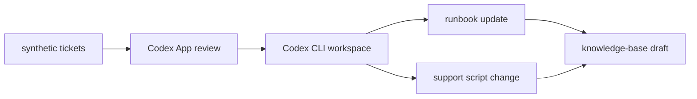

# Service Desk Knowledge Loop

Codex POC that turns synthetic recurring service desk tickets into a local review-and-update workflow for runbooks, support scripts, and knowledge-base drafts.

## Flow



## Getting Started

```bash
pnpm install
pnpm ingest:tickets
pnpm cluster:incidents
pnpm brief:pattern
pnpm validate:runbooks
pnpm check:vpn-demo
pnpm test
pnpm dev
pnpm build
pnpm preview
```

TODO: add supported local commands for full demo simulation, reset, and replay.
