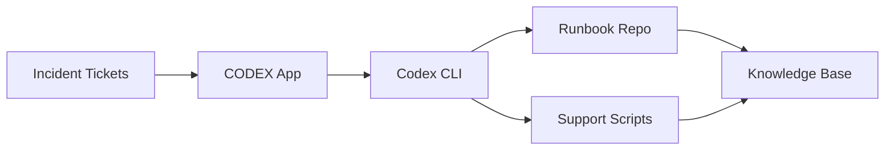

# Architecture

The POC separates human-facing review from repository edits.

Codex App represents the triage and review surface: it summarizes recurring incident evidence, proposes next actions, and keeps a service desk lead or operations owner in the loop before changes are accepted.

Codex CLI represents the controlled local workspace: it reads repo fixtures, edits runbooks or safe support scripts, runs validation, and writes file-based review artifacts without connecting to production systems.

The baseline implementation keeps those boundaries explicit: all data is synthetic, generated outputs stay in local folders, and no production connector, credential, script execution, or publishing path is part of the POC.
