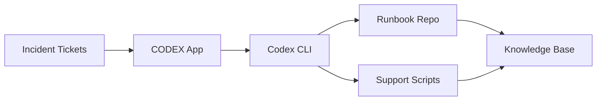

# PRD: Service Desk Knowledge Loop

## Overview

Build a demo-able Codex POC that turns recurring service desk incidents into proposed runbook updates, support script changes, knowledge-base drafts, and review-ready evidence.

## Architecture

## Problem

Service desk teams repeatedly handle similar incidents, but the fixes often stay trapped in ticket comments. Runbooks, automation scripts, and knowledge-base articles drift from the real support workflow.

## Goals

- Detect recurring incident patterns from a small ticket set.
- Use Codex App to summarize the pattern and propose an action plan.
- Use Codex CLI to update a runbook and a support script in a demo repository.
- Produce a knowledge-base draft and reviewer handoff.
- Show the workflow in an animated monitoring view.

## Non-Goals

- Directly connect to a live ITSM system for the POC.
- Auto-publish knowledge-base articles.
- Auto-run support scripts against production systems.
- Replace human review by service desk leads or operations owners.

## POC Users

- Service desk agent: reviews incident pattern and KB draft.
- Operations owner: reviews runbook and script changes.
- Demo viewer: watches the workflow progress through the monitoring UI.

## Demo Data Requirements

- A local `tickets/` folder with 12-20 synthetic incident tickets.
- At least three repeated issue clusters, such as VPN login failures, password reset loops, and printer queue stalls.
- A `runbooks/` folder with stale markdown runbooks.
- A `scripts/` folder with simple support scripts.
- A `kb/` folder for generated knowledge-base drafts.
- A `reviews/` folder for generated summaries and approval notes.

## Functional Requirements

- The system shall ingest synthetic ticket markdown or JSON files.
- The system shall group tickets by symptom, affected system, resolver action, and recurrence count.
- The system shall identify one high-confidence recurring incident pattern for the demo.
- The system shall ask Codex App to produce a short incident-pattern brief.
- The system shall ask Codex CLI to update the matching runbook.
- The system shall ask Codex CLI to patch or create a safe support script.
- The system shall generate a knowledge-base draft from the updated runbook and script behavior.
- The system shall create a reviewer handoff containing changed files, rationale, risks, and verification steps.
- The system shall not publish or execute production actions automatically.

## Codex Workflow Requirements

- Codex App should be used for triage, summarization, and human-facing review.
- Codex CLI should be used for repository edits, local validation, and file-based outputs.
- Codex must preserve existing file ownership and avoid unrelated refactors.
- Codex must cite ticket IDs or filenames when explaining why a change was proposed.
- Codex must produce a final handoff that separates facts from recommendations.

## Evaluation Requirements

- Golden ticket fixtures should have expected incident clusters.
- The eval should check whether the correct recurring pattern is selected.
- The eval should check whether runbook changes cite the right ticket evidence.
- The eval should check whether support script changes are scoped and non-destructive.
- The eval should check whether the KB draft is understandable to a service desk agent.
- The eval should penalize hallucinated systems, missing ticket references, and production execution claims.
- The eval should include at least one false-positive trap where similar tickets have different root causes.

## Animated Monitoring View Requirements

- Build a frontend monitoring view for the POC using HTML/CSS/JS, React, or canvas.
- The view should animate ticket cards flowing from `Incident Tickets` to `CODEX App`.
- The view should show Codex App producing a pattern brief.
- The view should animate handoff from `CODEX App` to `Codex CLI`.
- The view should show file-change pulses for `Runbook Repo` and `Support Scripts`.
- The view should show both outputs converging into `Knowledge Base`.
- The view should include a timeline with states: ingesting, clustering, briefing, editing, validating, ready for review.
- The view should include counters for ticket count, cluster count, files changed, and review status.
- The view should support replaying the demo without rerunning Codex.
- The view should use mock event data loaded from a local JSON file.

## POC Acceptance Criteria

- A user can run the demo from a local workspace.
- The demo produces one updated runbook, one script change, one KB draft, and one reviewer handoff.
- The animated monitoring view clearly shows the end-to-end knowledge loop.
- The POC can be reset by restoring fixture files.
- No real credentials, tickets, or production systems are required.
- Mermaid diagrams in documentation parse successfully.

## Production Design

In production, the service desk system would provide governed ticket access through an approved connector or export. Codex App would operate as the review and orchestration surface for support leads. Codex CLI would run only in controlled repositories with branch protections, test gates, and human approval.

Production integrations should include:

- ITSM connector for incident tickets, comments, tags, and resolution notes.
- Repository integration for runbooks, automation scripts, and KB source files.
- Identity and access controls for service desk, operations, and approver roles.
- Audit logging for prompts, source artifacts, proposed changes, approvals, and publication events.
- CI checks for support scripts and documentation linting.
- Publishing workflow for approved KB articles.

## Production Safety Requirements

- Codex must not execute remediation scripts against production systems.
- Codex must create pull requests or review packets rather than direct commits to protected branches.
- Ticket data containing personal information must be redacted or minimized before use.
- Generated KB content must require service desk lead approval before publishing.
- Script changes must include dry-run mode and rollback notes.
- All actions must be attributable to a user, ticket set, and approval record.

## Open Questions

- Which ITSM system should the production version target first?
- Should KB content live in markdown, a CMS, or a service desk knowledge module?
- What support script languages are in scope for the first POC?
- Who approves runbook changes versus script changes?
- What retention policy applies to ticket-derived evidence?
